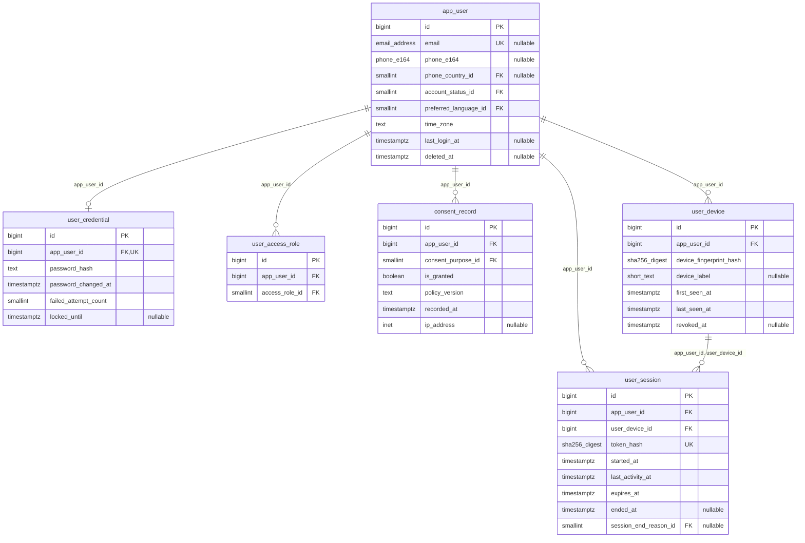
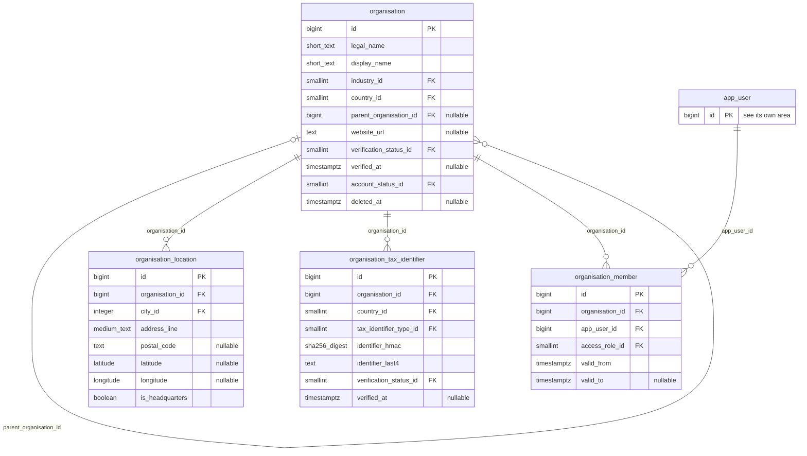
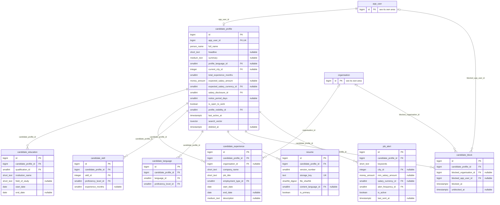
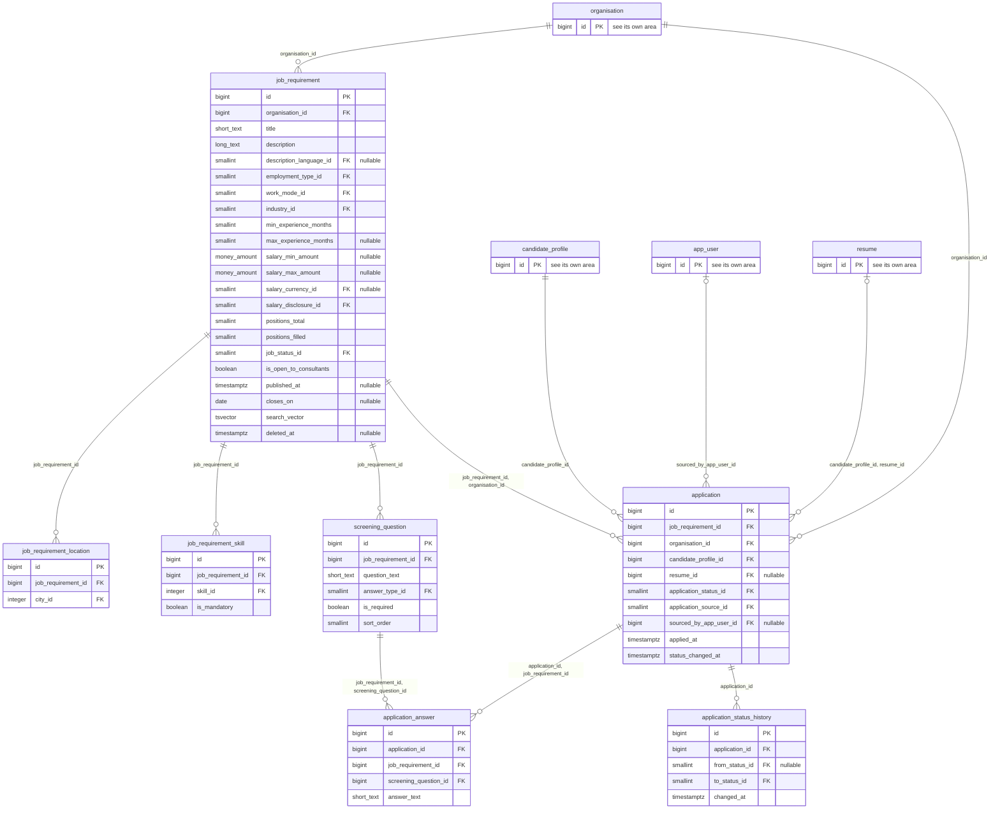
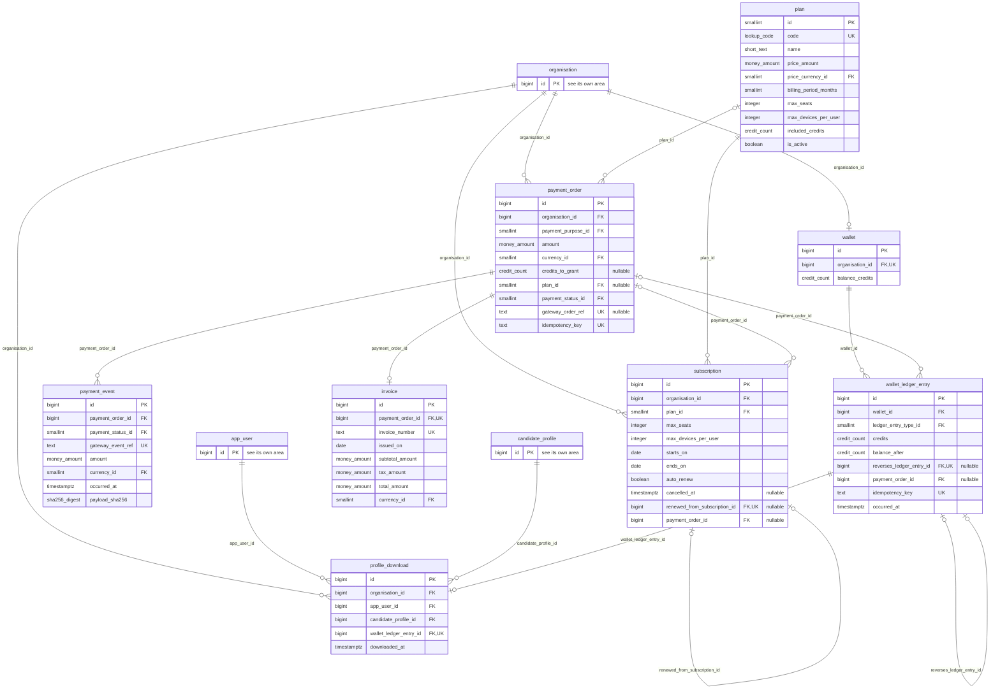
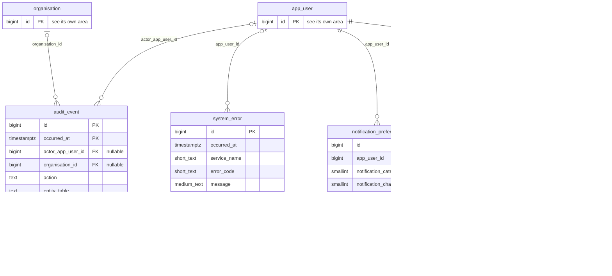

### Identity and access

```mermaid
erDiagram
    app_user ||--o| user_credential : "app_user_id"
    app_user ||--o{ user_access_role : "app_user_id"
    app_user ||--o{ consent_record : "app_user_id"
    app_user ||--o{ user_device : "app_user_id"
    app_user ||--o{ user_session : "app_user_id"
    user_device ||--o{ user_session : "app_user_id, user_device_id"
    app_user {
        bigint id PK
        email_address email UK "nullable"
        phone_e164 phone_e164 "nullable"
        smallint phone_country_id FK "nullable"
        smallint account_status_id FK
        smallint preferred_language_id FK
        text time_zone
        timestamptz last_login_at "nullable"
        timestamptz deleted_at "nullable"
    }
    user_credential {
        bigint id PK
        bigint app_user_id FK,UK
        text password_hash
        timestamptz password_changed_at
        smallint failed_attempt_count
        timestamptz locked_until "nullable"
    }
    user_access_role {
        bigint id PK
        bigint app_user_id FK
        smallint access_role_id FK
    }
    consent_record {
        bigint id PK
        bigint app_user_id FK
        smallint consent_purpose_id FK
        boolean is_granted
        text policy_version
        timestamptz recorded_at
        inet ip_address "nullable"
    }
    user_device {
        bigint id PK
        bigint app_user_id FK
        sha256_digest device_fingerprint_hash
        short_text device_label "nullable"
        timestamptz first_seen_at
        timestamptz last_seen_at
        timestamptz revoked_at "nullable"
    }
    user_session {
        bigint id PK
        bigint app_user_id FK
        bigint user_device_id FK
        sha256_digest token_hash UK
        timestamptz started_at
        timestamptz last_activity_at
        timestamptz expires_at
        timestamptz ended_at "nullable"
        smallint session_end_reason_id FK "nullable"
    }
```

### Organisation

```mermaid
erDiagram
    organisation |o--o{ organisation : "parent_organisation_id"
    organisation ||--o{ organisation_location : "organisation_id"
    organisation ||--o{ organisation_tax_identifier : "organisation_id"
    organisation ||--o{ organisation_member : "organisation_id"
    app_user ||--o{ organisation_member : "app_user_id"
    organisation {
        bigint id PK
        short_text legal_name
        short_text display_name
        smallint industry_id FK
        smallint country_id FK
        bigint parent_organisation_id FK "nullable"
        text website_url "nullable"
        smallint verification_status_id FK
        timestamptz verified_at "nullable"
        smallint account_status_id FK
        timestamptz deleted_at "nullable"
    }
    organisation_location {
        bigint id PK
        bigint organisation_id FK
        integer city_id FK
        medium_text address_line
        text postal_code "nullable"
        latitude latitude "nullable"
        longitude longitude "nullable"
        boolean is_headquarters
    }
    organisation_tax_identifier {
        bigint id PK
        bigint organisation_id FK
        smallint country_id FK
        smallint tax_identifier_type_id FK
        sha256_digest identifier_hmac
        text identifier_last4
        smallint verification_status_id FK
        timestamptz verified_at "nullable"
    }
    organisation_member {
        bigint id PK
        bigint organisation_id FK
        bigint app_user_id FK
        smallint access_role_id FK
        timestamptz valid_from
        timestamptz valid_to "nullable"
    }
    app_user {
        bigint id PK "see its own area"
    }
```

### Candidate profile

```mermaid
erDiagram
    app_user ||--o| candidate_profile : "app_user_id"
    candidate_profile ||--o{ candidate_education : "candidate_profile_id"
    candidate_profile ||--o{ candidate_experience : "candidate_profile_id"
    organisation |o--o{ candidate_experience : "organisation_id"
    candidate_profile ||--o{ candidate_skill : "candidate_profile_id"
    candidate_profile ||--o{ candidate_language : "candidate_profile_id"
    candidate_profile ||--o{ resume : "candidate_profile_id"
    candidate_profile ||--o{ candidate_block : "candidate_profile_id"
    organisation |o--o{ candidate_block : "blocked_organisation_id"
    app_user |o--o{ candidate_block : "blocked_app_user_id"
    candidate_profile ||--o{ job_alert : "candidate_profile_id"
    candidate_profile {
        bigint id PK
        bigint app_user_id FK,UK
        person_name full_name
        short_text headline "nullable"
        medium_text summary "nullable"
        smallint profile_language_id FK "nullable"
        integer current_city_id FK "nullable"
        smallint total_experience_months
        money_amount expected_salary_amount "nullable"
        smallint expected_salary_currency_id FK "nullable"
        smallint salary_disclosure_id FK
        smallint notice_period_days "nullable"
        boolean is_open_to_work
        smallint profile_visibility_id FK
        timestamptz last_active_at
        tsvector search_vector
        timestamptz deleted_at "nullable"
    }
    candidate_education {
        bigint id PK
        bigint candidate_profile_id FK
        smallint qualification_id FK
        short_text institution_name
        short_text field_of_study "nullable"
        date start_date
        date end_date "nullable"
    }
    candidate_experience {
        bigint id PK
        bigint candidate_profile_id FK
        bigint organisation_id FK "nullable"
        short_text company_name
        short_text job_title
        smallint employment_type_id FK
        date start_date
        date end_date "nullable"
        medium_text description "nullable"
    }
    candidate_skill {
        bigint id PK
        bigint candidate_profile_id FK
        integer skill_id FK
        smallint proficiency_level_id FK
        smallint experience_months "nullable"
    }
    candidate_language {
        bigint id PK
        bigint candidate_profile_id FK
        smallint language_id FK
        smallint proficiency_level_id FK
    }
    resume {
        bigint id PK
        bigint candidate_profile_id FK
        smallint version_number
        text storage_key UK
        sha256_digest file_sha256
        smallint content_language_id FK "nullable"
        boolean is_primary
    }
    candidate_block {
        bigint id PK
        bigint candidate_profile_id FK
        bigint blocked_organisation_id FK "nullable"
        bigint blocked_app_user_id FK "nullable"
        timestamptz blocked_at
        timestamptz unblocked_at "nullable"
    }
    job_alert {
        bigint id PK
        bigint candidate_profile_id FK
        short_text keywords
        integer city_id FK "nullable"
        money_amount min_salary_amount "nullable"
        smallint salary_currency_id FK "nullable"
        smallint alert_frequency_id FK
        boolean is_active
        timestamptz last_sent_at "nullable"
    }
    app_user {
        bigint id PK "see its own area"
    }
    organisation {
        bigint id PK "see its own area"
    }
```

### Jobs and applications

```mermaid
erDiagram
    job_requirement ||--o{ job_requirement_location : "job_requirement_id"
    organisation ||--o{ job_requirement : "organisation_id"
    job_requirement ||--o{ job_requirement_skill : "job_requirement_id"
    job_requirement ||--o{ screening_question : "job_requirement_id"
    organisation ||--o{ application : "organisation_id"
    candidate_profile ||--o{ application : "candidate_profile_id"
    app_user |o--o{ application : "sourced_by_app_user_id"
    job_requirement ||--o{ application : "job_requirement_id, organisation_id"
    resume |o--o{ application : "candidate_profile_id, resume_id"
    application ||--o{ application_answer : "application_id, job_requirement_id"
    screening_question ||--o{ application_answer : "job_requirement_id, screening_question_id"
    application ||--o{ application_status_history : "application_id"
    job_requirement {
        bigint id PK
        bigint organisation_id FK
        short_text title
        long_text description
        smallint description_language_id FK "nullable"
        smallint employment_type_id FK
        smallint work_mode_id FK
        smallint industry_id FK
        smallint min_experience_months
        smallint max_experience_months "nullable"
        money_amount salary_min_amount "nullable"
        money_amount salary_max_amount "nullable"
        smallint salary_currency_id FK "nullable"
        smallint salary_disclosure_id FK
        smallint positions_total
        smallint positions_filled
        smallint job_status_id FK
        boolean is_open_to_consultants
        timestamptz published_at "nullable"
        date closes_on "nullable"
        tsvector search_vector
        timestamptz deleted_at "nullable"
    }
    job_requirement_location {
        bigint id PK
        bigint job_requirement_id FK
        integer city_id FK
    }
    job_requirement_skill {
        bigint id PK
        bigint job_requirement_id FK
        integer skill_id FK
        boolean is_mandatory
    }
    screening_question {
        bigint id PK
        bigint job_requirement_id FK
        short_text question_text
        smallint answer_type_id FK
        boolean is_required
        smallint sort_order
    }
    application {
        bigint id PK
        bigint job_requirement_id FK
        bigint organisation_id FK
        bigint candidate_profile_id FK
        bigint resume_id FK "nullable"
        smallint application_status_id FK
        smallint application_source_id FK
        bigint sourced_by_app_user_id FK "nullable"
        timestamptz applied_at
        timestamptz status_changed_at
    }
    application_answer {
        bigint id PK
        bigint application_id FK
        bigint job_requirement_id FK
        bigint screening_question_id FK
        short_text answer_text
    }
    application_status_history {
        bigint id PK
        bigint application_id FK
        smallint from_status_id FK "nullable"
        smallint to_status_id FK
        timestamptz changed_at
    }
    organisation {
        bigint id PK "see its own area"
    }
    candidate_profile {
        bigint id PK "see its own area"
    }
    resume {
        bigint id PK "see its own area"
    }
    app_user {
        bigint id PK "see its own area"
    }
```

### Billing and licences

```mermaid
erDiagram
    organisation ||--o{ subscription : "organisation_id"
    plan ||--o{ subscription : "plan_id"
    subscription |o--o| subscription : "renewed_from_subscription_id"
    organisation ||--o| wallet : "organisation_id"
    organisation ||--o{ payment_order : "organisation_id"
    plan |o--o{ payment_order : "plan_id"
    payment_order |o--o{ subscription : "payment_order_id"
    payment_order ||--o{ payment_event : "payment_order_id"
    organisation ||--o{ profile_download : "organisation_id"
    wallet ||--o{ wallet_ledger_entry : "wallet_id"
    wallet_ledger_entry |o--o| wallet_ledger_entry : "reverses_ledger_entry_id"
    payment_order |o--o{ wallet_ledger_entry : "payment_order_id"
    payment_order ||--o| invoice : "payment_order_id"
    app_user ||--o{ profile_download : "app_user_id"
    candidate_profile ||--o{ profile_download : "candidate_profile_id"
    wallet_ledger_entry ||--o| profile_download : "wallet_ledger_entry_id"
    plan {
        smallint id PK
        lookup_code code UK
        short_text name
        money_amount price_amount
        smallint price_currency_id FK
        smallint billing_period_months
        integer max_seats
        integer max_devices_per_user
        credit_count included_credits
        boolean is_active
    }
    subscription {
        bigint id PK
        bigint organisation_id FK
        smallint plan_id FK
        integer max_seats
        integer max_devices_per_user
        date starts_on
        date ends_on
        boolean auto_renew
        timestamptz cancelled_at "nullable"
        bigint renewed_from_subscription_id FK,UK "nullable"
        bigint payment_order_id FK "nullable"
    }
    wallet {
        bigint id PK
        bigint organisation_id FK,UK
        credit_count balance_credits
    }
    wallet_ledger_entry {
        bigint id PK
        bigint wallet_id FK
        smallint ledger_entry_type_id FK
        credit_count credits
        credit_count balance_after
        bigint reverses_ledger_entry_id FK,UK "nullable"
        bigint payment_order_id FK "nullable"
        text idempotency_key UK
        timestamptz occurred_at
    }
    payment_order {
        bigint id PK
        bigint organisation_id FK
        smallint payment_purpose_id FK
        money_amount amount
        smallint currency_id FK
        credit_count credits_to_grant "nullable"
        smallint plan_id FK "nullable"
        smallint payment_status_id FK
        text gateway_order_ref UK "nullable"
        text idempotency_key UK
    }
    payment_event {
        bigint id PK
        bigint payment_order_id FK
        smallint payment_status_id FK
        text gateway_event_ref UK
        money_amount amount
        smallint currency_id FK
        timestamptz occurred_at
        sha256_digest payload_sha256
    }
    invoice {
        bigint id PK
        bigint payment_order_id FK,UK
        text invoice_number UK
        date issued_on
        money_amount subtotal_amount
        money_amount tax_amount
        money_amount total_amount
        smallint currency_id FK
    }
    profile_download {
        bigint id PK
        bigint organisation_id FK
        bigint app_user_id FK
        bigint candidate_profile_id FK
        bigint wallet_ledger_entry_id FK,UK
        timestamptz downloaded_at
    }
    organisation {
        bigint id PK "see its own area"
    }
    app_user {
        bigint id PK "see its own area"
    }
    candidate_profile {
        bigint id PK "see its own area"
    }
```

### Notifications and audit

```mermaid
erDiagram
    app_user |o--o{ audit_event : "actor_app_user_id"
    organisation |o--o{ audit_event : "organisation_id"
    app_user |o--o{ system_error : "app_user_id"
    app_user ||--o{ notification_preference : "app_user_id"
    app_user ||--o{ notification : "app_user_id"
    notification_preference {
        bigint id PK
        bigint app_user_id FK
        smallint notification_category_id FK
        smallint notification_channel_id FK
        boolean is_enabled
    }
    notification {
        bigint id PK
        bigint app_user_id FK
        smallint notification_category_id FK
        smallint notification_channel_id FK
        text template_key
        jsonb payload
        smallint notification_status_id FK
        text dedupe_key UK "nullable"
        smallint attempt_count
        timestamptz queued_at
        timestamptz next_attempt_at
        timestamptz sent_at "nullable"
        timestamptz delivered_at "nullable"
        text provider_message_ref UK "nullable"
        short_text failure_reason "nullable"
    }
    audit_event {
        bigint id PK
        timestamptz occurred_at PK
        bigint actor_app_user_id FK "nullable"
        bigint organisation_id FK "nullable"
        text action
        text entity_table
        bigint entity_id "nullable"
        jsonb details
    }
    system_error {
        bigint id PK
        timestamptz occurred_at
        short_text service_name
        short_text error_code
        medium_text message
        bigint app_user_id FK "nullable"
        jsonb context
    }
    app_user {
        bigint id PK "see its own area"
    }
    organisation {
        bigint id PK "see its own area"
    }
```
